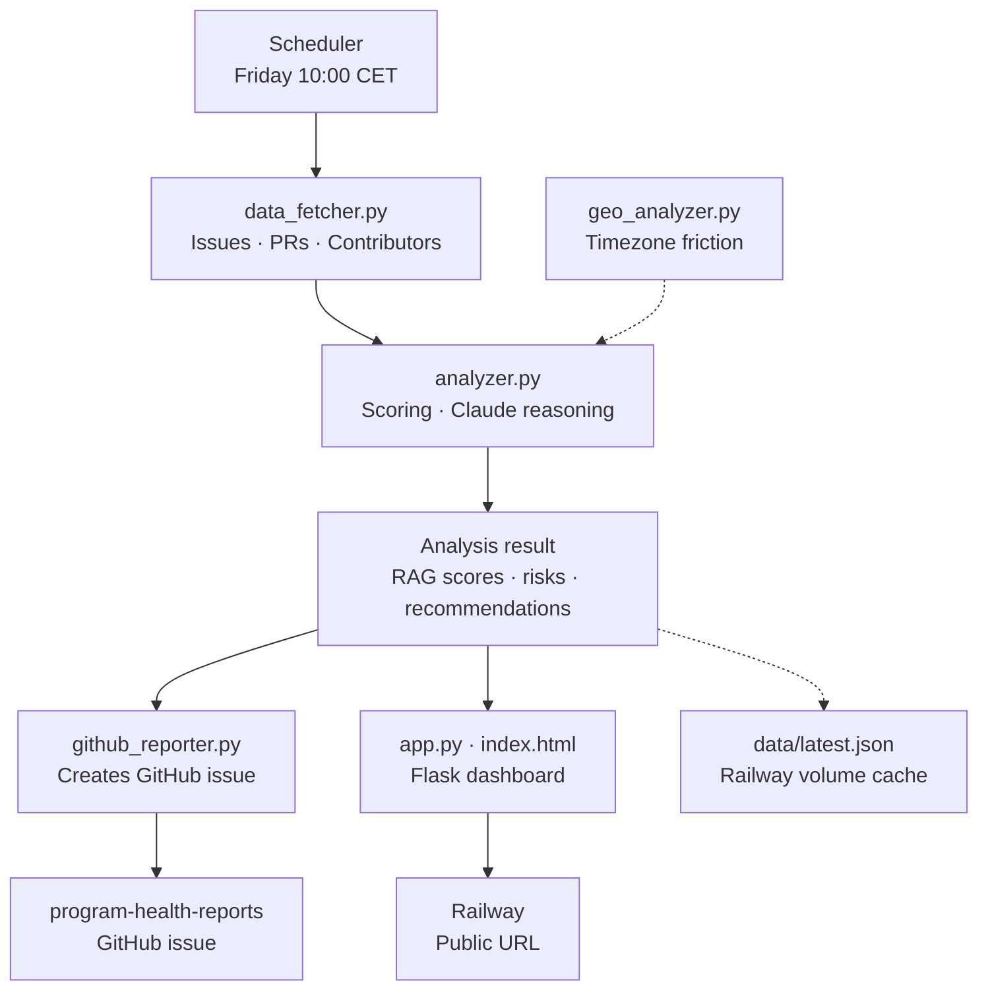

```mermaid
flowchart TD
    A[Scheduler\nFriday 10:00 CET] --> B[data_fetcher.py\nIssues · PRs · Contributors]
    B --> C[analyzer.py\nScoring · Claude reasoning]
    G[geo_analyzer.py\nTimezone friction] -.-> C
    C --> D[Analysis result\nRAG scores · risks · recommendations]
    D --> E[github_reporter.py\nCreates GitHub issue]
    D --> F[app.py · index.html\nFlask dashboard]
    E --> H[program-health-reports\nGitHub issue]
    F --> I[Railway\nPublic URL]
    D -.-> J[data/latest.json\nRailway volume cache]
```